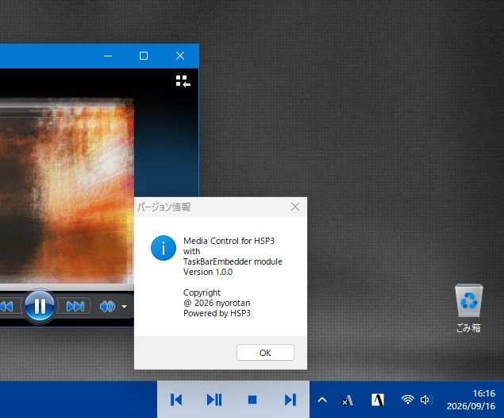
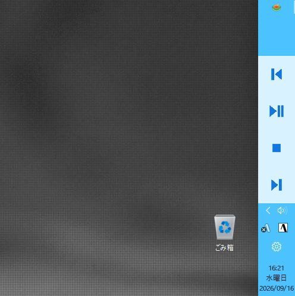

🌐 **English** | [Japanese](./README.ja.md)

# Media Control for HSP3  
with TaskBarEmbedder module



This project provides a sample application that embeds small media‑control buttons into the Windows taskbar, as well as a module (`TaskBarEmbedder.as`) that makes it easy to add the same functionality to your own HSP3 applications.

The main goal is to let you create a "DESKBAND‑like" always‑on‑taskbar controller in HSP3 with minimal effort.

---

## User Guide (How to use)

The sample app places four buttons on the edge of the taskbar, allowing you to control playback, pause, previous track, and next track.

**Button functions:**
- 1st: Previous track
- 2nd: Play / Pause
- 3rd: Stop
- 4th: Next track

A right‑click on the control shows an exit menu.

The app works by sending media‑key events to the currently active music player. Some applications may require additional configuration to accept global media keys.

If the taskbar icons are **center‑aligned** on Windows 11, the module temporarily forces left‑alignment while it runs and restores the original layout on exit.

### 1. Prerequisites

- The app sends media‑key events, so you may need to enable global media keys in your OS or the target music application.
- Some players require permission to receive background control or global keys; without this the buttons will not respond.
- If the taskbar layout is unusual, the embedding might not work correctly.

### 2. Reference implementation – vertical taskbar



- Vertical taskbar embedding is supported (Windows 10 only).
- This is an experimental implementation and may break with future Windows 11 updates, so treat it as a reference only.

### 3. Caveats

- The taskbar position and size change with Windows settings, so the button appearance and placement may vary.
- On Windows 11 the layout may change, causing the embedded control to overlap existing icons.
- On Windows 10 such overlap rarely occurs.

---

## Developer Guide (Embedding the module)

### Project Philosophy

The project ships the `TaskBarEmbedder.as` module, which allows you to embed a tiny controller into the taskbar, inspired by the classic DESKBAND concept.

- Classic DESKBAND embedded a window into the taskbar for persistent UI or simple controls.
- This module brings the same idea to HSP3, making it easy to develop lightweight always‑on‑taskbar utilities.

### Basic Usage

First, include the module in your HSP3 script:

```hsp3
#include "TaskBarEmbedder.as"
onexit *s_exit

GetTaskBarPosition
tpos = stat
GetTaskBarPhysicalSize tbW, tbH

if (tpos == TASKBAR_POS_LEFT) | (tpos == TASKBAR_POS_RIGHT) {
    screen 0, tbW, 400
    EmbedTargetWindowVertical hwnd, tbW, 400
} else {
    screen 0, 400, tbH
    EmbedTargetWindow hwnd, 400, tbH
}

stop

*s_exit
    CleanupTaskBarEmbedding
    end
```

### Typical Workflow

1. Retrieve the taskbar position.
2. Get the physical size of the taskbar.
3. Adjust your application window size accordingly.
4. Determine whether the taskbar is horizontal or vertical.
5. Call `EmbedTargetWindow` (horizontal) or `EmbedTargetWindowVertical` (vertical).
6. Always call `CleanupTaskBarEmbedding` on exit.

### Main Functions Provided by the Module

| Function / Command | Type | Description | Return value |
| :--- | :--- | :--- | :--- |
| `EmbedTargetWindow` | `#deffunc` | Embed a window into a horizontal taskbar | `stat`: container HWND (0 on failure) |
| `EmbedTargetWindowVertical` | `#deffunc` | Embed a window into a vertical taskbar | `stat`: container HWND (0 on failure) |
| `GetTaskBarPhysicalSize` | `#deffunc` | Retrieve the physical width and height of the taskbar | `stat`: 0 on success, -1 on failure |
| `GetTaskBarSize` | `#deffunc` | Alias of `GetTaskBarPhysicalSize` |
| `GetTaskBarPhysicalWidth()` | `#defcfunc` | Returns taskbar width in pixels | width, -1 on failure |
| `GetTaskBarWidth()` | `#defcfunc` | Alias of `GetTaskBarPhysicalWidth` |
| `GetTaskBarPhysicalHeight()` | `#defcfunc` | Returns taskbar height in pixels |
| `GetTaskBarHeight()` | `#defcfunc` | Alias of `GetTaskBarPhysicalHeight` |
| `GetTaskBarPosition` | `#deffunc` | Determines taskbar placement (top, bottom, left, right) |
| `Check_win11` | `#deffunc` | Checks whether the taskbar is from Windows 11 |
| `CleanupTaskBarEmbedding` | `#deffunc` | Removes the embedding and restores taskbar settings |

#### `EmbedTargetWindow` Example

```hsp3
EmbedTargetWindow hwnd, 400, 80
```
- Used for a horizontal taskbar.
- Arguments: target window handle, embed width, embed height.

#### `EmbedTargetWindowVertical` Example

```hsp3
EmbedTargetWindowVertical hwnd, 80, 400
```
- Used for a vertical taskbar.
- Arguments: target window handle, embed width, embed height.
- This is experimental and may be affected by future Windows changes.

#### `GetTaskBarPosition` Example

```hsp3
GetTaskBarPosition
pos = stat
```
- `TASKBAR_POS_TOP` = 0
- `TASKBAR_POS_BOTTOM` = 1
- `TASKBAR_POS_LEFT` = 2
- `TASKBAR_POS_RIGHT` = 3

#### `GetTaskBarPhysicalSize` Example

```hsp3
GetTaskBarPhysicalSize tbW, tbH
```
- Retrieves the physical pixel size of the taskbar, taking DPI into account.

#### `CleanupTaskBarEmbedding` Example

```hsp3
CleanupTaskBarEmbedding
```
- Must be called when the application exits or when re‑embedding.
- Restores hook removal, parent‑child relationship, and taskbar settings.

---

## Transparency Handling

Lines 322 and 468 contain transparency settings for horizontal and vertical embedding:

```hsp3
SetLayeredWindowAttributes _tb_mhtask, 0xffffff, 200, 0x2
```
- `0x2` (`LWA_ALPHA`) with `bAlpha = 200` makes the container about 78 % opaque.
- To make the white background (`0xffffff`) fully transparent, change the flag to `0x1` (`LWA_COLORKEY`).  
Example:

```hsp3
SetLayeredWindowAttributes _tb_mhtask, 0xffffff, 200, 0x1
```

## Windows 10 vs Windows 11 Differences

### Windows 10
- Uses `ReBarWindow32` adjustments to create margin.
- Overlap with other icons is rare.
- Generally more stable.

### Windows 11
- Taskbar layout has changed, causing possible overlap with existing icons.
- The module may temporarily modify `TaskbarAl` to adjust layout.
- Behaviour can vary depending on user settings; full stability cannot be guaranteed.

---

## Project Positioning

This repository is more than a simple media‑control demo; it is intended for:
- Easy taskbar embedding in HSP3.
- Building small always‑on‑utility tools.
- Experimenting with a DESKBAND‑style experience.

Because UI layout depends heavily on the OS version and DPI, it may not be 100 % stable on all Windows 11 configurations, but it is sufficient for rapid prototyping.

---

## License

This project is released under the **NYSL (Niru nari Yaku nari Suki ni Shiro License)**.

```
Do whatever you like with it—boil it, grill it, or whatever.
```
- **Copyright**: © 2026 nyorotan

## Version Information

- **Version**: v1.0.0
- **Author**: nyorotan
